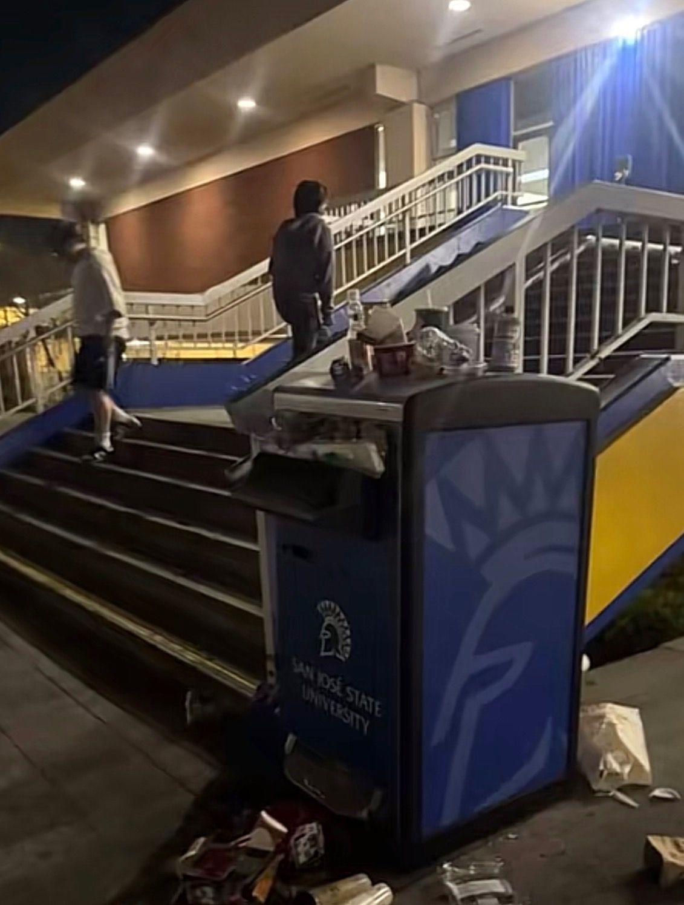
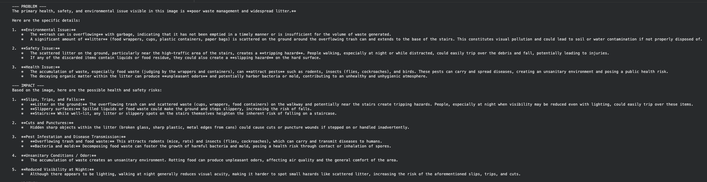
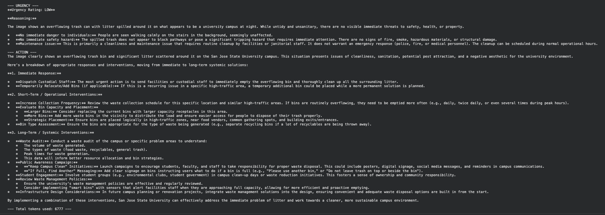
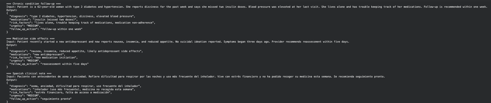

# AI for Social Good: Campus Health and Safety Reporting Assistant

## Problem

Health and safety issues at San José State University, such as overflowing garbage cans, litter, and hazardous public spaces, are visible on campus but often go unreported or receive low priority. An SJSU student who sees overflowing trash next to a crowded stairway while strolling around campus at night. The problem could lead to slipping hazards, pest attraction, or sanitary issues.

The information is available visually or in brief written reports, but it is not organized in a way that makes it easy for campus workers to comprehend the problem, its urgency, and the necessary course of action. Because it focuses on enhancing campus public health and safety response, this initiative is in line with SDG 3: Good Health and Well-Being.

## AI Capability

This project uses two AI capabilities from the labs: structured data extraction and image recognition.

Because written reports are frequently disorganized and unstructured, Lab 2 makes sense. These reports are transformed by the AI into standard areas like issue, risk factors, urgency, follow-up action, and responsible team.

Since many campus issues are visual, Lab 3 makes sense. When a student uploads a picture, the AI can recognize obvious health or safety hazards, gauge the level of urgency, and recommend a course of action. When combined, these tools aid in transforming disorganized inputs into organized data that can be examined by people.

## Workflow

Input: A student files a written complaint or uploads a picture of a health or safety concern on campus.

AI step: The image recognition model examines the picture for obvious problems, potential dangers, urgency, and suggested courses of action. Written reports are converted into consistent fields using the structured extraction technique.

Output: A structured report outlining the problem, risk factors, degree of urgency, next steps, and accountable team is generated by the system.

Who takes action: After reviewing the AI output, campus facilities employees or public health professionals determine what needs to be done, including planning a cleanup or conducting an investigation.

### Example Outputs

## Failure Case

When the AI examined the image of the campus trash, one failure case emerged. Although overflowing trash and other sanitary hazards were appropriately identified by the AI, it also made assumptions about hazards that were not fully obvious in the image. This demonstrates that while the AI can identify clear visual issues, it may overgeneralize in the absence of sufficient information.

The AI may determine that a problem is more or less urgent than it actually is, which has practical ramifications. For instance, students may continue to be exposed to hazardous or unhygienic conditions if overflowing trash in a busy area is only classified as medium urgency.

## Oversight and Tradeoff

Before taking any action, the AI output should be reviewed by a human. Because they are able to comprehend context that the AI could overlook, such as how busy the area is or how long the problem has been, campus facilities staff or public health professionals ought to make the ultimate choice.

Adding location and context information, such as the precise campus location and whether the area is busy, is one modification that would lessen harm. This would improve the accuracy of the urgency classification. The trade-off is that it slows down a fully automated system and necessitates more data collection.
